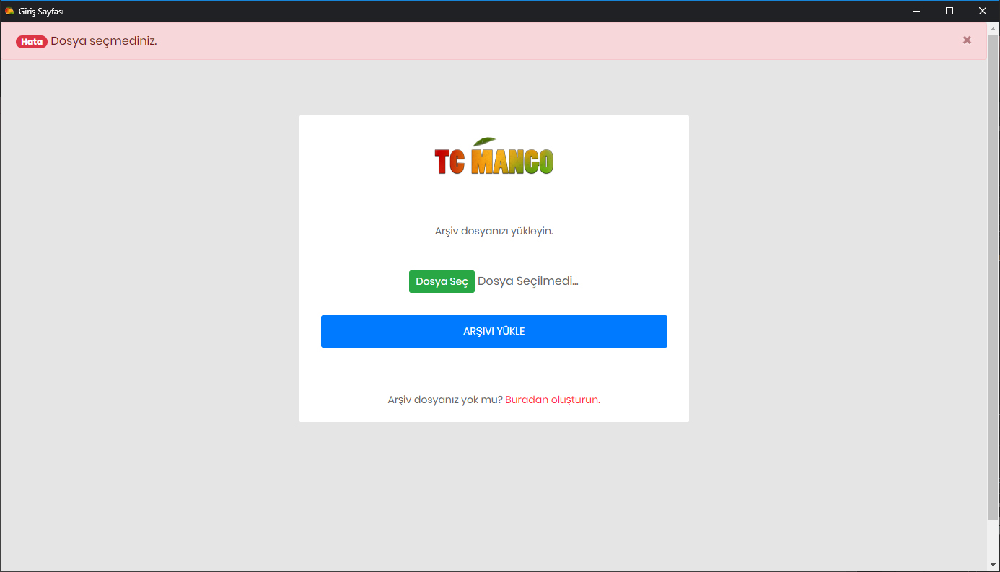
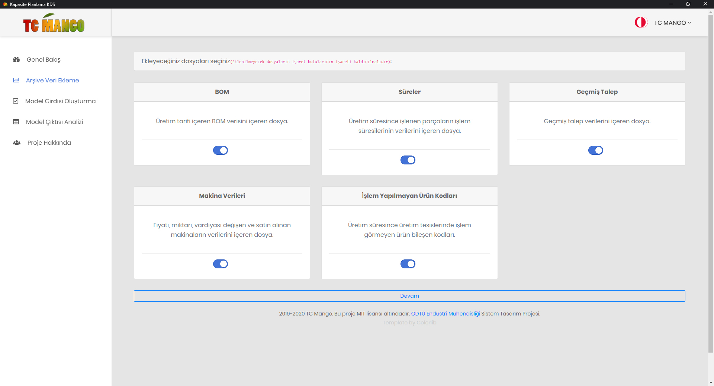
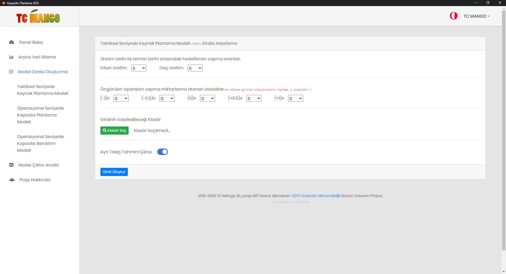
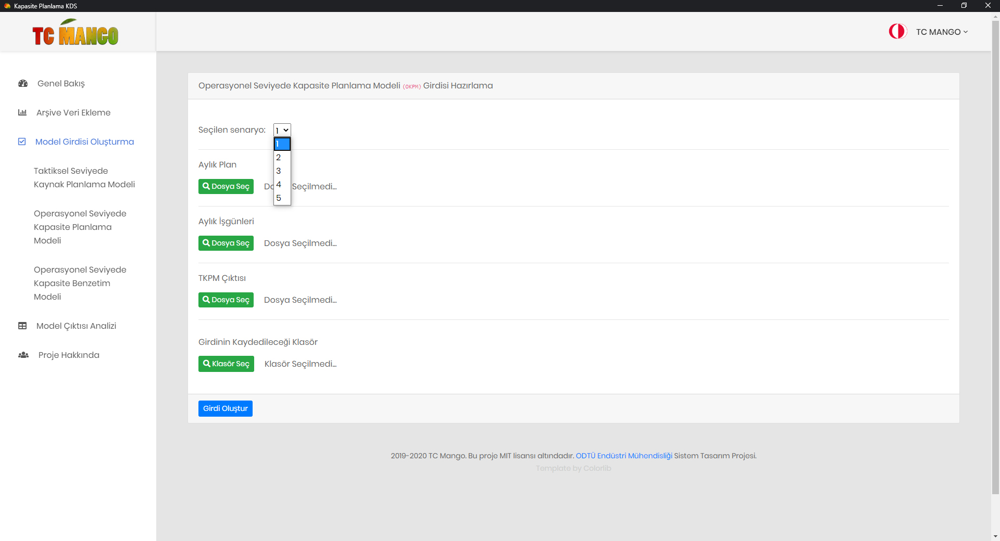

# CapacityPlanningDSS-SD

**This repository is the codebase of the 2019-2020 METU IE System Design project of team TC MANGO.**
<br /><br />What this tool basically does is to fetch various data to process those data so that they can be 
used for the project's two-levelled capacity evaluation.<br /><br />The softwares used for mathematical 
programming and simulation are:</p>
<ul>
<li>GAMS
<li>Arena Simulation
</ul>

<p>Welcome page</p>



<p>Database update</p>



<p>Input file creation examples</p>

<p> </p>


<h2>Structure</h2>

```python
backend/
        utils/
              demand_util.py -> past demand archival functions
              df_ops.py -> dataframe transformation and data manipulation functions 
              errors.py -> custom errors
              file_dialog.py -> file opening and saving dialogs(written in python since the frontend is based on javascript)
              finder.py -> frequently made search operations' functions
              xl_ops.py -> excel file reading and writing functions and exceptions handling        
        
        analyzer.py -> GAMS and Arena Simulation output file analysis tools
        compiler.py -> classes of input files and database. the whole system basically runs out of this file
        predictor.py -> Holt-Winter's forecasting snippet

frontend/
        pythonjs/
                backend-communicator.js -> Python-Js communication's Js side.

main.py -> program handler and Python-Js communication's Python side. 

Huge thanks to Samuel Williams for Eel library.


```

## License
[MIT](https://choosealicense.com/licenses/mit/)

**Repository created and maintained by Nizar Can, @nizarcan**.

_Frontend template by Colorlib_
